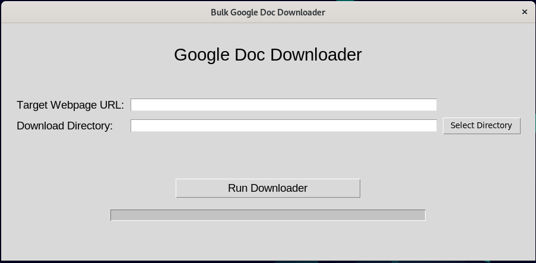

# Bulk Google Doc Downloader

**Table of Contents:**

1. [Overview](#overview)
	- [Version Info](#version-info)
	- [Description](#description)
	- [Requirements](#requirements)
	- [How to Use](#how-to-use)
1. [Installation](#installation)
	 - [Windows Installer](#windows-installer)
	 - [Run as a Script](#run-as-a-script)
1.  [Troubleshooting](#troubleshooting)
1. [License](#licence)

## **Overview**

### Version Info
Current Version: 1.0.0 -- Initial commit that's been tested but may still have some bugs.

### Description
This program takes a user specified webpage, then searches for links to all google docs and downloads each one to a specified directory on the user's computer.

### Requirements
In order to run this program you will need the following:
- A reliable Internet connection
- Read/Write permissions on the directory you'll be downloading to.

If you start the program as a Python script rather than installing it with the Windows Installer Provided in this repo you'll need to manually install software dependencies.  Starting the program in the terminal using Python will work on Linux, Mac, and Windows (see the section [Run as a Script](#run-as-a-script)).  The following software must be installed on your computer in order to start this program from the terminal:
- [Python3](https://www.python.org/downloads/)
- [pip](https://www.geeksforgeeks.org/download-and-install-pip-latest-version/)
- tkinter
	- Windows: tkinter is installed automatically when you install Python3 on Windows
	- Linux (Debian Distros): Open a terminal and run: ``` sudo apt install python3-tk```
	- Mac: Check out this page on geeksforgeeks.org: https://www.geeksforgeeks.org/how-to-install-tkinter-on-macos/
- urllib3: This can be installed with pip using the same terminal command for Windows, Linux, and Mac: ```pip3 install urllib3```
- BeatifulSoup4 (bs4): This can be installed using the same terminal command for Windows, Linux, and Max: ```pip3 install beautifulsoup4```
- gdown: Typically this is installed using pip but the current version as of this readme (version 5.2.0) will cause path not found errors on Windows when the Google Doc has a forward slash (/)in the title (it's fine on Linux... you should be using Linux, anyway).  Therefore, the current version of this Google Doc Downloader is built in with an edit to the gdown code that stops Windows from freezing the program.  The repo for the current version of gdown can be found here: [https://github.com/wkentaro/gdown](https://github.com/wkentaro/gdown).  Once the filepath bug is fixed the gdown package will be removed from this repo and instructions for installing via pip will be provided.
	

### How to Use
Bulk downloads of Google Docs links on a specified webpage will be donwloaded to a directory of the user's choosing.  Simply fill in the Target Webpage URL and Download Directory fields and click the "Run Downloader" button.  Further desctiptions of both input fields below.


- <ins>**Input field desctiptions:**</ins>
	- **Target Webpage URL**: This field is required.  Enter the URL for the webpage you want to target for downloading all Google Doc links that appear on it.  All URLs must start with either https// or http://, otherwise you'll get an error.  Webpages without Google Doc Links won't make any downloads, so be sure you're pointing to a page that actually has Google Doc Links.  This downloader will not work in any Google Drive folders, it only works on webpages with Google Doc links for docs available to the public.  
	- **Download Directory**: This field is required.  Use the "Select Directory" button to open a file navigator window and navigate to the directory you want to download the Google Docs to.  Alteratively, you could copy/paste a file path or type one out.  Depending on your user's permissions on your computer, this program will create a new directory if the one you enter doesn't actually exist.  If Google Doc filenames already exist in the download directory, they will be overwritten by the newer download.

## **Installation**
This program can be installed as an application on Windows, which removes the need for installing python, pip, tkinter, urllib3, BeatifulSoup, and gdown.  Simply use instructions under Windows Installer below.  In order to run this program on Linux or Mac, you will need to run it as a Python script.  See the section below for "Run as a Script".  

### Windows Installer
There are a number of ways to grab the installer, the easiest being to click on the Windows Installer folder in the program files in the github repository to access the installer file.  Once in the folder double click on the installer file (named something along the lines of GoogleDocDownloader_WINDOWS_installer_1.0.0). There is a download button on the right side of the screen.  Click that to download the installer.  Users can also clone the full git repository or download the ZIP file on the github page.  Access the download link for the zip file by clicking on the green button in the upper right corner of the repository homepage labled <>Code.  You'll find the download link for the zip file in the dropdown that appears after clicking the <> Code button. After unzipping the file go into the Windows_Installer directory and click on the OpenLibraryIsbnParser_WINDOWS_installer_1.0.0 file. This will initiate the installation process. You'll be guided by the installation wizard to install the program and add shortcut on your desktop if you choose to do so.  Users have the option of an admin install where all users on that computer will have access to the parser program.  This requires admin privileges, so if the user doesn't have admin privileges they should choose the "Install for me only" option. It may generate warnings that way, but you shouldn't need admin privileges when making that selection. This program also runs in tandem with a console window.  The console window will display information that can be helpful in troubleshooting problems. 

### Run as a Script
You can start this program in Linux, Windows, and Mac as a Python script using a command line terminal.  If this is the route you take you must be sure to install all software dependencies yourself (see the section for [Requirements](#requirements) above). To run as a script start by opening a terminal (bash for Linux and Mac, PowerShell for Windows) and go to the directory where the Main.py file is stored in the repository. Both bash and PowerShell terminals can change directories by running this command: ```cd /path/to/WorldCatApiParser.py```.  Once in the proper directory run this command if you're using Windows: ```python.exe Main.py``` and run this command if using Linux or Mac: ```python3 Main.py```.  This should cause the user interface to appear.

### Troublshooting
- **Bug Reporting**: No bugs have been found, yet, but when they are bug reports can be submitted to Jeremiah Kellogg via email: jkellogg@eou.edu.  Please include a step-by-step narative for how the bug was discovered. 

## **License**
MIT No Attribution License

Copyright (c) 2025 Easter Oregon University

Permission is hereby granted, free of charge, to any person obtaining a copy of this software and associated documentation files (the “Software”), to deal in the Software without restriction, including without limitation the rights to use, copy, modify, merge, publish, distribute, sublicense, and/or sell copies of the Software, and to permit persons to whom the Software is furnished to do so.

THE SOFTWARE IS PROVIDED “AS IS”, WITHOUT WARRANTY OF ANY KIND, EXPRESS OR IMPLIED, INCLUDING BUT NOT LIMITED TO THE WARRANTIES OF MERCHANTABILITY, FITNESS FOR A PARTICULAR PURPOSE AND NONINFRINGEMENT. IN NO EVENT SHALL THE AUTHORS OR COPYRIGHT HOLDERS BE LIABLE FOR ANY CLAIM, DAMAGES OR OTHER LIABILITY, WHETHER IN AN ACTION OF CONTRACT, TORT OR OTHERWISE, ARISING FROM, OUT OF OR IN CONNECTION WITH THE SOFTWARE OR THE USE OR OTHER DEALINGS IN THE SOFTWARE.
